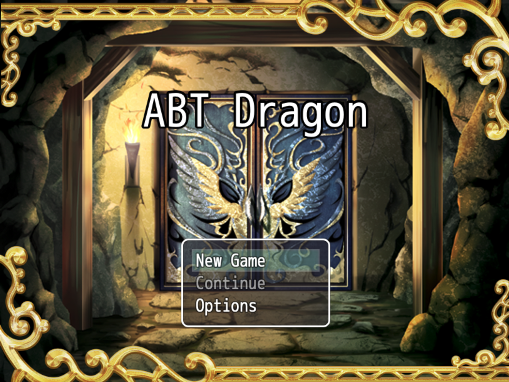
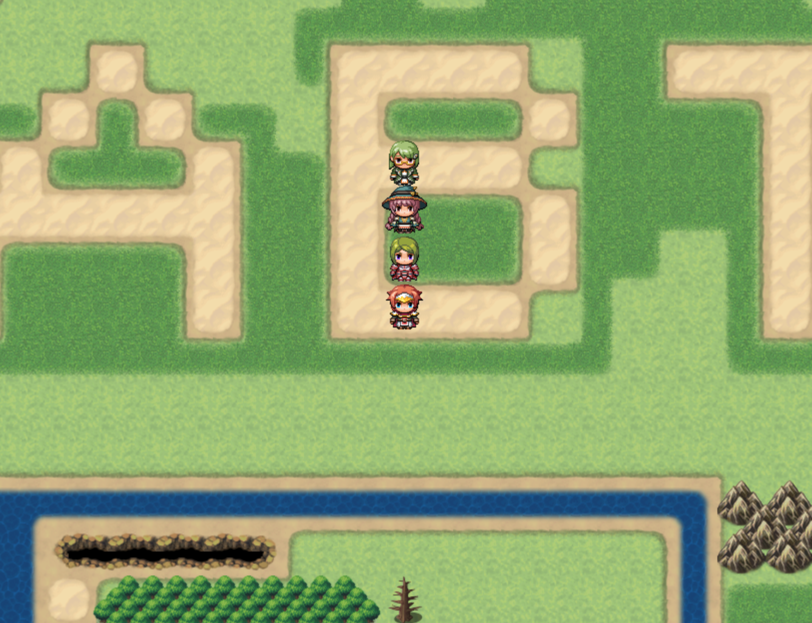

# RPG Maker Demo Blocklet


[RPG Maker](https://www.rpgmakerweb.com/products/rpg-maker-mv) powered web RPG game Blocklet demo.

Note: this is a minimalist demo purpose game generated with RPG Maker just to showcase how you can use ABT Node to deploy and host online RPG games.

## Install on my ABT Node

[](https://install.arcblock.io/?action=blocklet-install&meta_url=https%3A%2F%2Fgithub.com%2Fblocklet%2Frpgmaker-demo%2Freleases%2Fdownload%2Fv1.0.9%2Fblocklet.json)

## Run and debug in the cloud with Gitpod

Click the "Open in Gitpod" button, Gitpod will start ABT Node and the blocklet.

[](https://gitpod.io/#https://github.com/blocklet/rpgmaker-demo)

## Run and debug locally

If you want to edit the game itself, install RPG Maker MV and open the project under `src` directory. `www` directory is generated by RPG Maker from the project.

```shell
yarn global add @abtnode/cli
git clone git@github.com:blocklet/rpgmaker-demo.git
cd rpgmaker-demo
abtnode init --mode debug
abtnode start
abtnode dev
```

# Screenshots





## License

The code is licensed under the MIT license found in the
[LICENSE](LICENSE) file.
